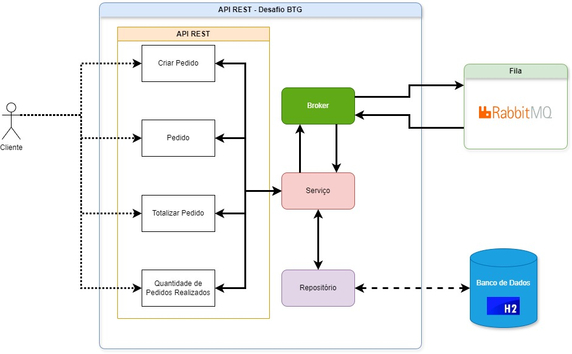
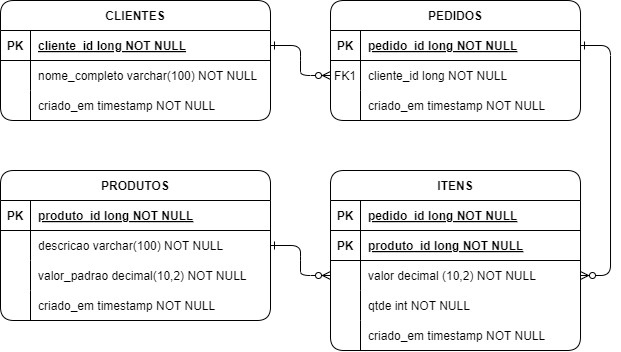
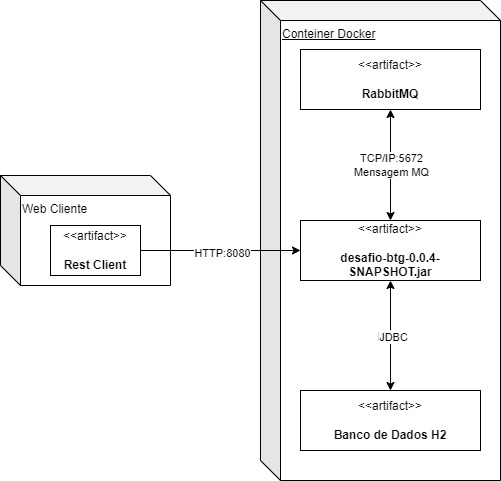

<div  align="center" style="text-align: center; font-size:xx-large;font-weight: bold;"> Desafio BTG</div>
<div align="center">
Projeto realizado a partir do desafio proposto pelo BTG
</div>


## Tecnologias
 
- [Spring Boot - Versão 3.2.5](https://spring.io/projects/spring-boot)
- [Spring MVC - Versão 3.2.5](https://docs.spring.io/spring-framework/reference/web/webmvc.html)
- [Spring Data JDBC - Versão 3.2.5](https://spring.io/projects/spring-data-jdbc)
- [Spring Data JPA - Versão 3.2.5](https://spring.io/projects/spring-data-jpa)
- [Spring Test - Versão 3.2.5](https://docs.spring.io/spring-framework/reference/web/webmvc-test.html)
- [Spring AMQP - Versão 3.1.4](https://spring.io/projects/spring-amqp)
- [Apache RabbitMQ - Versão 3.13.3](https://www.rabbitmq.com/)
- [Docker Compose - Versão 24.0.7 Build afdd53b](https://docs.docker.com/compose/)
- [H2 - Versão 2.2.224](https://www.h2database.com/html/main.html)
- [Simple Logging Facade for Java (SLF4J) - Versão 2.0.13](https://slf4j.org/)
- [JAVA ORACLE - Versão 21.0.1](https://www.oracle.com/java/technologies/java-se-glance.html)
- [IDE Eclipse - Versão: 2024-03 (4.31.0) Build id: 20240307-1437](https://www.eclipse.org/)
- [Windows - Versão: 10](https://www.microsoft.com/pt-br/windows/?r=1)

## Como Executar

- Clonar repositório git:
```
git clone https://github.com/jader75/desafio-btg.git
```
<p/>
 - Executar a composição docker da aplicação SpringBoot e RabbitMQ:
```
docker-compose up
<p/>
- Acessar aplicação em `http://localhost:8080`.

###Diagrama de Arquitetura


###Modelo de Dados


###Diagrama de Implantação


## API
<li>Valor Total Pedido - Metodo GET</li>

```
http://localhost:8080/pedido/[idPedido]/total
```
<li>Quantidade Pedidos Por Cliente - Metodo GET</li>

```
http://localhost:8080/pedido/cliente/[idCliente]/quantidade
```
<li>Pedidos Realizados Por Cliente - Metodo GET</li>

```
http://localhost:8080/pedido/cliente/[idCliente]
```
<li>Enviar Pedido - Metodo POST</li>

```
http://localhost:8080/pedido/criar
```

BODY

```
{
        "cliente": {
            "clienteId": 2
        },
        "itens": [
            {
                "itemId": {
                    "produtoId": 1
                },
                "quantidade": 30
            },
            {
                "itemId": {
                    "produtoId": 4
                },
                "quantidade": 20
            },
            {
                "itemId": {
                    "produtoId": 6
                },
                "quantidade": 10
            },
            {
                "itemId": {
                    "produtoId": 8
                },
                "quantidade": 15
            },
            {
                "itemId": {
                    "produtoId": 3
                },
                "quantidade": 33
            }
        ]
    }
}
```
###Coleção Postman versão 2.1
Arquivo: **DesafioBTG.postman_collection.json**

**Requests:**
<ul>
<li>Valor Total Pedido</li>
<li>Quantidade Pedidos Por Cliente</li>
<li>Pedidos Realizados Por Cliente</li>
<li>Enviar Pedido</li>
</ul>